# TP 30 - Pipeline CI/CD avec Jenkins, GitHub, Docker et ngrok

Ce TP présente la mise en place d'une chaîne CI/CD complète automatisant le build, la conteneurisation avec Docker et le déploiement d'une application Spring Boot via un Pipeline Jenkins déclenché par des Webhooks GitHub exposés par ngrok.

---

## 1. Installation et première connexion à Jenkins
Jenkins a été installé et configuré sur le port 8080 avec les plugins recommandés.

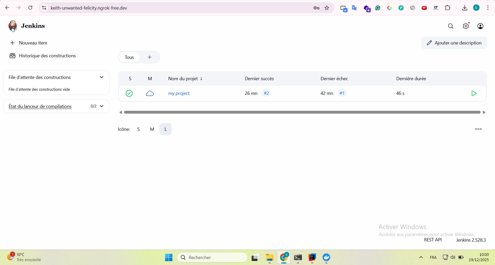

## 2. Configuration de Maven dans Jenkins
Configuration de l'outil Maven dans "Tools" pour permettre la compilation du projet.

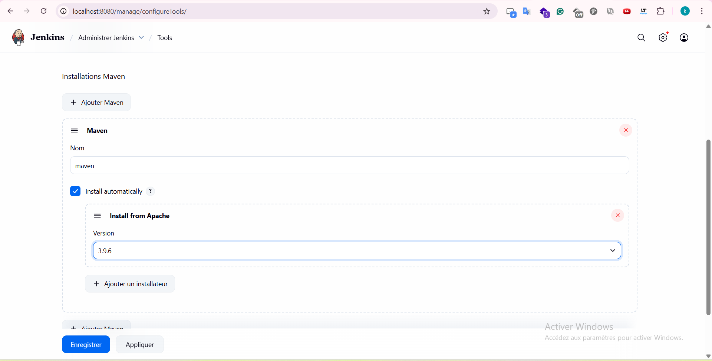

## 3. Préparation du projet et Dockerfile
Vérification de la compilation locale et création du `Dockerfile` pour l'image de l'application.

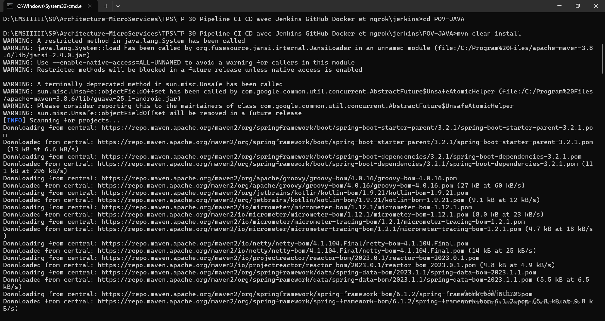
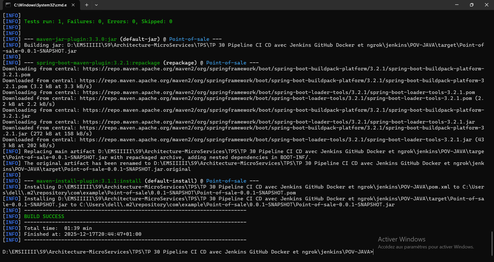

```dockerfile
FROM eclipse-temurin:17-jre
WORKDIR /App
COPY target/*.jar app.jar
EXPOSE 8282
ENTRYPOINT ["java","-jar","app.jar"]
```

## 4. Création et exécution du Pipeline Jenkins
Création d'un pipeline pointant vers GitHub avec les étapes : Git Clone, Build, Create Docker Image, et Run.

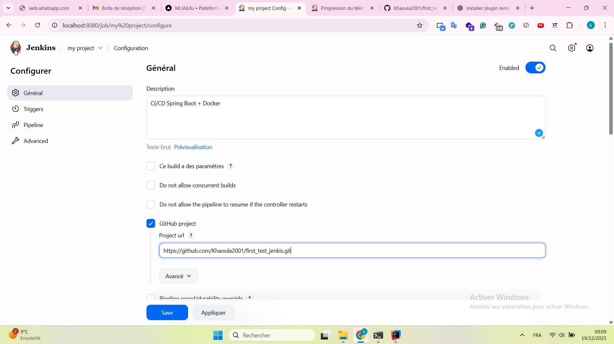
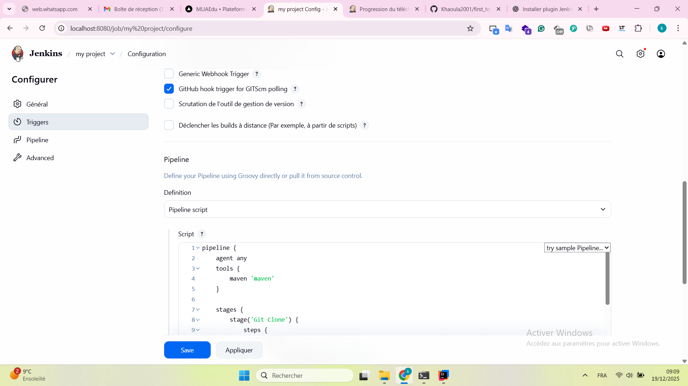
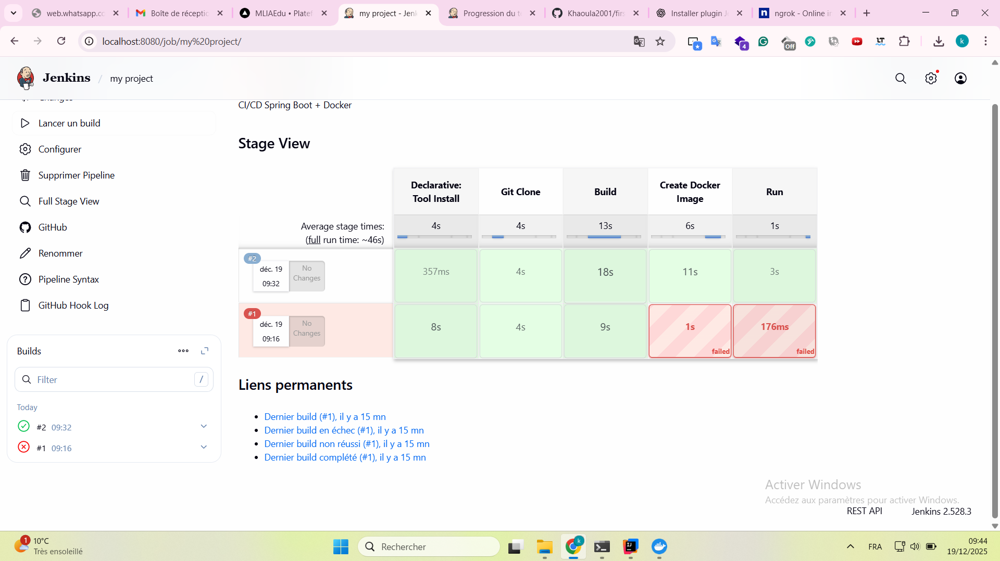


## 5. Automatisation avec ngrok et Webhooks GitHub
Mise en place d'un tunnel ngrok pour exposer Jenkins et configuration du Webhook sur le dépôt GitHub.

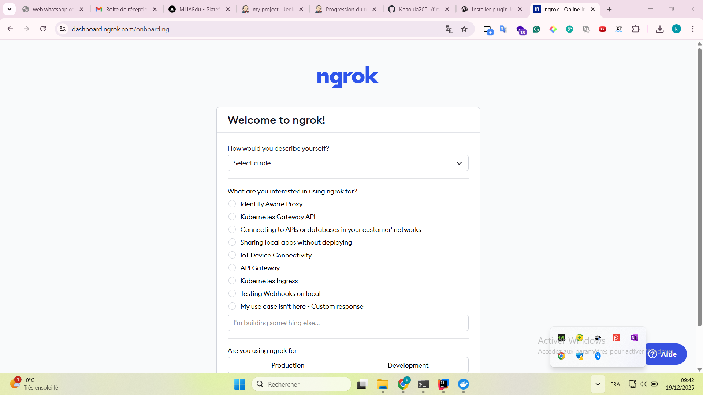
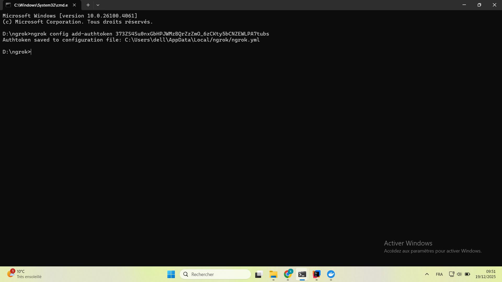
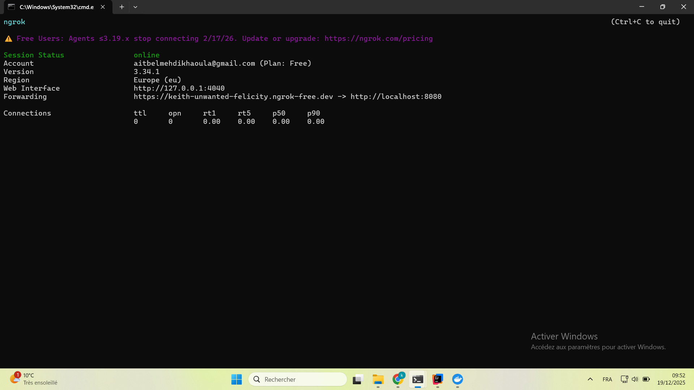
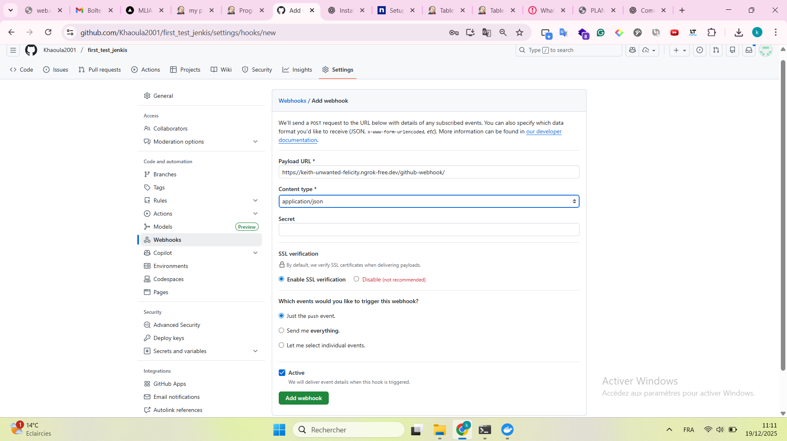
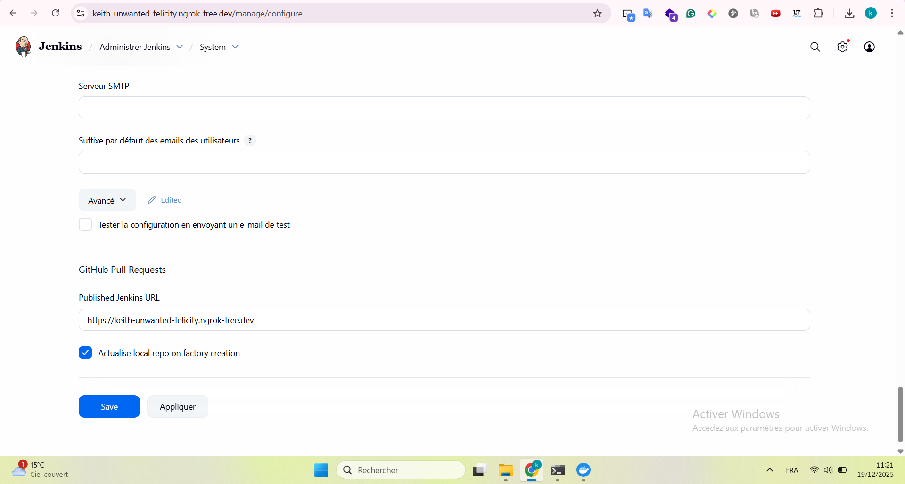

## 6. Test du déclenchement automatique (Git Push)
Validation finale : un `git push` déclenche instantanément le pipeline Jenkins via le Webhook.

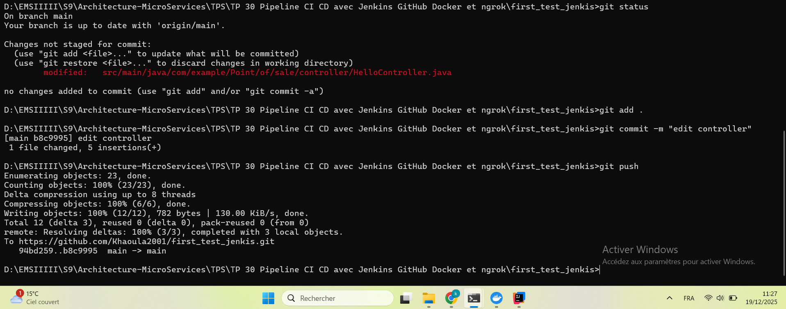
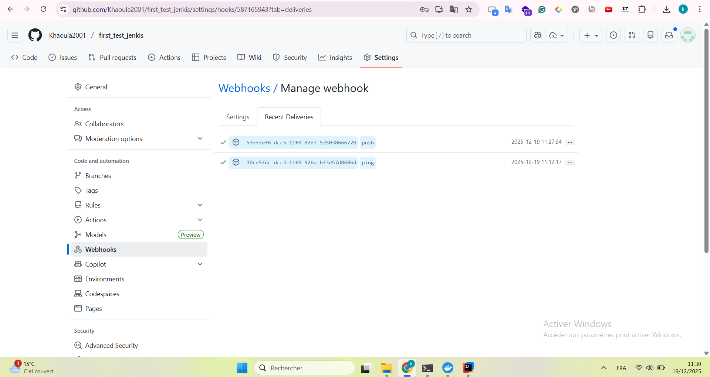
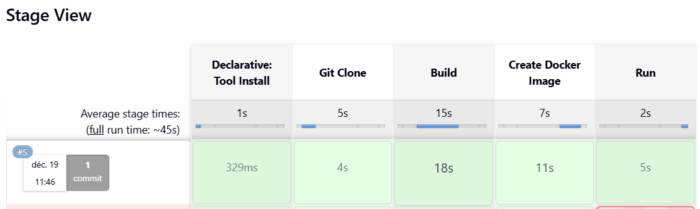
